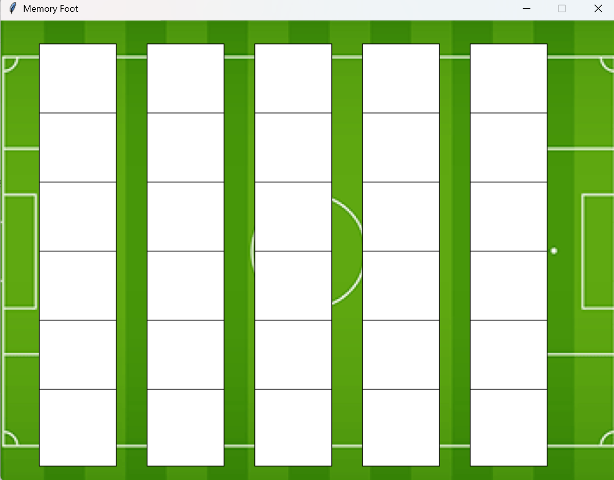
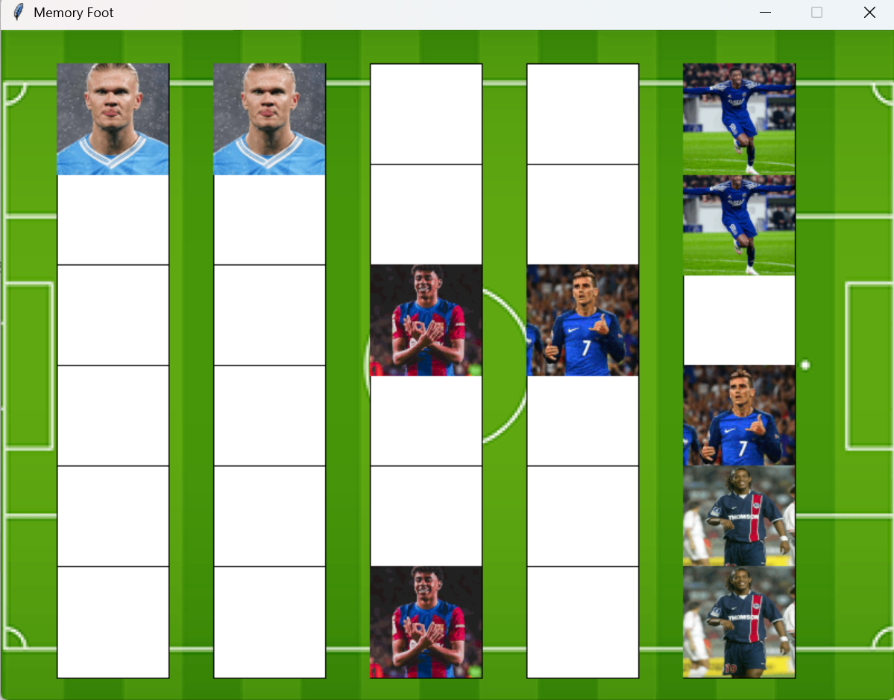
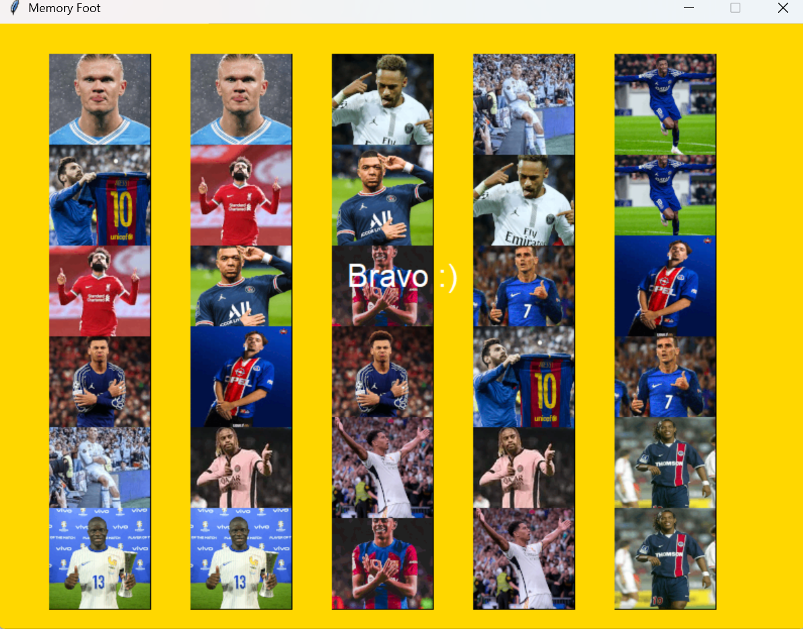

# 🧠 Memory - Jeu de Memory en Python

Bienvenue dans mon petit jeu de **Memory**, réalisé en **Python** avec la librairie **graphics.py** en mai 2024🎮  
Ce projet a été conçu **pour le fun**, afin de m'exercer à la programmation événementielle et à la gestion graphique.

## 🎯 Objectif du jeu

Le but est simple :  
Retourne les cartes deux par deux et retrouve toutes les **paires de joueurs de foot** ! ⚽

## 🛠️ Technologies utilisées

- Python 3
- [graphics.py](http://mcsp.wartburg.edu/zelle/python/graphics.py) (librairie graphique simple)
- Gestion d’événements clavier/souris
- Logique de jeu : aléatoire, timer, vérification de paires, comptage de clics

